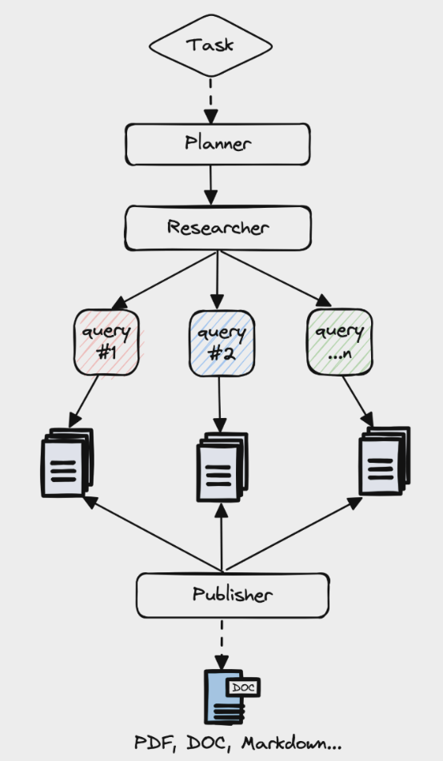

# AI Tutor Agent

An AI-powered tutor agent that generates questions based on Bloom's Taxonomy from your learning materials.

## Features

- Document processing for large files (up to 25MB)
- Support for various file formats (PDF, TXT, etc.)
- RAG (Retrieval-Augmented Generation) architecture
- Question generation based on Bloom's Taxonomy levels:
  - Remember (recall facts)
  - Understand (explain concepts)
  - Apply (use in new situations)
  - Analyze (draw connections)
  - Evaluate (justify positions)
  - Create (produce new work)
- Comprehensive document coverage
- Answer evaluation with detailed feedback

## Setup

1. Clone the repository
2. Install dependencies:
```bash
pip install -r requirements.txt
```
3. Set up your OpenAI API key:
```bash
export OPENAI_API_KEY=your_api_key_here
```

## Usage

1. Start the server:
```bash
uvicorn tutor_agent.main:app --reload
```

2. Create an essay session by uploading a document:
```bash
curl -X POST -F "file=@your_document.pdf" -F "summary=Optional summary of the document" -F "num_questions=5" http://localhost:8000/start-essay
```

3. Get questions for an essay session:
```bash
curl -X GET http://localhost:8000/essay/{session_id}
```

4. Submit and evaluate an answer:
```bash
curl -X POST -H "Content-Type: application/json" \
  -d '{"session_id": "your_session_id", "question_idx": 0, "answer": "Your answer here"}' \
  http://localhost:8000/submit-answer
```

5. Generate more questions:
```bash
curl -X POST http://localhost:8000/generate-more-questions/{session_id}?num_questions=3
```

6. Delete an essay session:
```bash
curl -X DELETE http://localhost:8000/essay/{session_id}
```

## API Endpoints

- `POST /start-essay`: Create a new essay session by uploading a document
- `GET /essay/{session_id}`: Get questions for an essay session
- `POST /submit-answer`: Submit and evaluate an answer
- `POST /generate-more-questions/{session_id}`: Generate additional questions
- `DELETE /essay/{session_id}`: Delete an essay session

## Workflow

1. **Document Upload**: User uploads a document (can be up to 25MB) with an optional summary
2. **Question Generation**: System analyzes the document and generates questions across Bloom's Taxonomy levels
3. **Answer Submission**: User submits answers to questions
4. **Answer Evaluation**: System evaluates answers and provides detailed feedback
5. **Additional Questions**: User can request more questions if needed

## Architecture

The system uses a RAG (Retrieval-Augmented Generation) architecture:
1. Documents are processed and split into chunks
2. Document is analyzed to identify key topics and sections
3. Questions are generated to ensure comprehensive coverage
4. Answers are evaluated using the original document context

## Dependencies

- FastAPI: Web framework
- LangChain: LLM framework
- OpenAI: LLM provider
- FAISS: Vector store
- Various document loaders for different file formats

## Progress
- [x] Setup a chatbot with tavily search tool from end to end with in memory cache
- [ ] Add state to maintain structure output

## Core Architecture
Inspired by [gpt-researcher](https://github.com/assafelovic/gpt-researcher/) core architecture


## License

This project is built upon [gpt-researcher](https://github.com/assafelovic/gpt-researcher/), which is licensed under the Apache License 2.0. Our project maintains the same license in accordance with the terms. You can find the full license text [here](LICENSE).

## Acknowledgments
- [gpt-researcher](https://github.com/assafelovic/gpt-researcher/) - Core architecture inspiration
- OpenAI for AI capabilities
- All contributors and supporters